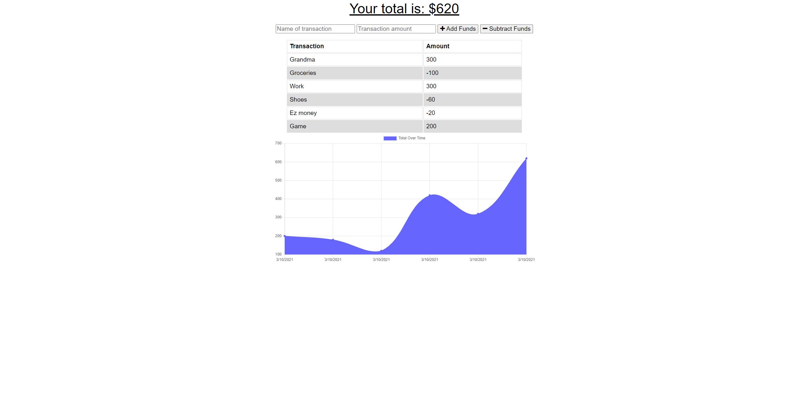

# budget-tracker

## Overview
This repository is for a budget tracking app to track funds. Users can add/subtract funds online and offline.

## Table of Contents

1. [Installation](#installation)

2. [Usage](#usage)

3. [Contributions](#contribution)

4. [Test Instructions](#test-instructions)

5. [Screenshots](#screenshots)

6. [Licenses](#licenses)

7. [Questions](#questions)

## Installation

 Fork the repository and run "npm i" in the CLI then use "npm start" to launch the app.

## Usage

Type the name and amount of the transaction in the form, next click add or subtract funds based on your needs. Once that is done the transaction will be shown along with your total funds left. 

## Contribution

None

## Test Instructions

None

## Screenshots

## License

    
## Questions? Contact Me!

My GitHub is [bo-stevenson](https://www.github.com/bo-stevenson).

My email is [bostevenson1027@gmail.com](mailto:bostevenson1027@gmail.com).
